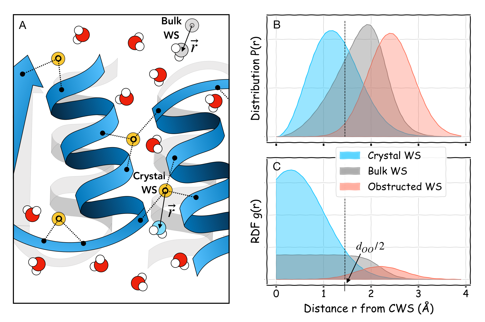

# LAWS: Local Alignment for Water Sites
## Algorithm for tracking ordered water in simulations 

Manuscript: https://www.biorxiv.org/content/early/2022/05/13/2022.05.12.491708



## Description
- `laws.py` contains the multilateration algorithm and all the necessary optimization pipelines.
- `compute_bulk_r.py` contains the code to compute offset vectors **r** and distances |r| for bulk water sites.
- `compute_global_r.py` contains the code to compute offset vectors **r**, distances |r| for globally aligned CWS.
- `compute_laws_r.py` contains the code to compute offset vectors **r**, distances |r| and the correponding LAWS errors for the CWS tracked by our local alignment algorithm (LAWS). Additionally, it saves moving positions of the CWS into a new trajectory which can be visualized (as in Fig.4A of the manuscript) with VMD or PyMOL.
- `crystal.gro` contains the constructed unit cell of the system described in the manuscript (PDZ domain of a human LNX2), with a total of four symmetrically related chains and 4 copies of 94 CWS. Note that the protein atoms numbering corresponds to the numbering in simulation file `firsframe_fix.gro` (available at https://doi.org/10.5281/zenodo.6478270). CWS are listed consequtively after all protein atoms of four chains and have resids 501-594. 


## Installation

The LAWS algorithm relies on the open-source `MDAnalysis` [module](https://www.mdanalysis.org/) and `scipy` optimization, as well as `MPI4py` library for the parallel computing: 

```
pip install scipy
pip install --upgrade MDAnalysis
pip install mpi4py
```

## Standard Command Line Usage (with MPI)

User should adjust parameters in the code according to MD system they analyze (see details in comment section of each file): 
- `firstframe.gro` - simulation structure file (.GRO or similar).
- `trajectory.xtc` - simulation trajectory file (.XTC or similar).
- `crystal.gro` - crystal structure (protein + crystal waters).
- `N_chains`- number of symmetric chains in the simulation.
- `N_atoms_in_chain` - number of protein atoms in each chain.
- `n_waters` - number of CWS in the crystal structure

After adjusting parameters specific to your MD simulation, run the codes:
```
python compute_bulk_r.py
mpirun -np 4 python compute_laws_r.py
mpirun -np 4 python compute_global_r.py
```
The output of these programs (`distances.npy`) can be used for plotting distribution P(r) and radial density function g(r) = P(r) / r^2, or (`offsets.npy`) as an input for 3D density calculators (e.g. Gromaps). 

## MD simulation data
MD simulation data is publicly available from [Zenodo](https://doi.org/10.5281/zenodo.6478270) at DOI: https://doi.org/10.5281/zenodo.6478270. These structure and trajectory files can be used to test the algorithm. The constructed unit cell of a crystal structure (second PDZ domain of LNX2, PDBID: 5E11) with CWS is available from here: [crystal.gro](https://github.com/rauscher-lab/LAWS/blob/main/crystal.gro).

## Citation
If you use these codes in your research, please cite our manuscript:
```
@article {LAWS,
	author = {Klyshko, Eugene and Kim, Justin Sung-Ho and Rauscher, Sarah},
	title = {LAWS: Local Alignment for Water Sites {\textemdash} tracking ordered water in simulations},
	year = {2022},
	doi = {10.1101/2022.05.12.491708},
	URL = {https://www.biorxiv.org/content/early/2022/05/13/2022.05.12.491708},
	journal = {bioRxiv}
}

```
